# SGI 2023/2024

## Group T02G06
| Name             | Number    | E-Mail             |
| ---------------- | --------- | ------------------ |
| Bárbara Carvalho | 202004695 | up202004695@fe.up.pt |
| Luís Cabral      | 202006464 | up202006464@fe.up.pt |

----

## Projects

### [TP1 - ThreeJS Basics](tp1)

#### Project Description

In the course of this project, we constructed a room, complete with a table bearing a birthday cake as its centerpiece. The room's ambiance is further enhanced by the addition of frames adorning the walls, alongside a vase containing a flower. Additionally, the room has other objects, such as a door as well as a window with a view of the outdoor surroundings.

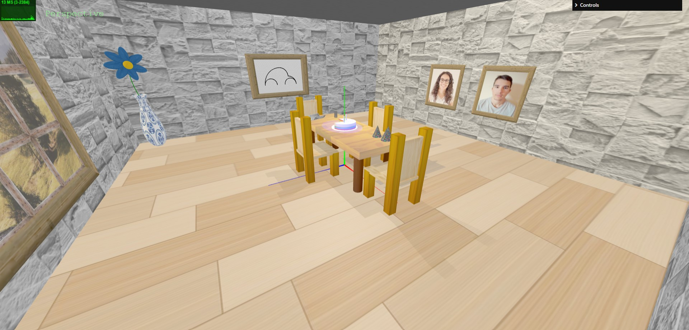

#### Scene

The main focus of this room is the table being displayed in the middle. We built this table using BoxGeometry for the top part and CylinderGeometry for its legs.
To add a little complexity to the scene, we created some chairs with two different textures.

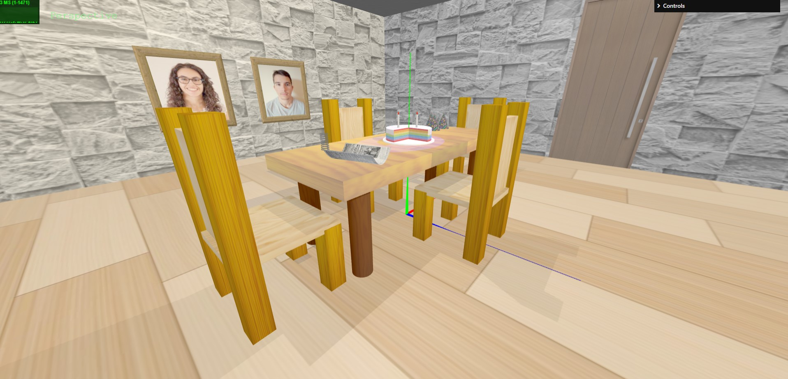

Then, we started constructing the cake. This part was a bit tricky, since we didn't want to draw the whole cake. We decided to start with a CylinderGeometry changing the theta length, so it was a three quarter cake. The problem was there was no inside, so we used two small planes to represent it. In the end, we only had to add the right textures: one for the top part of the cake, another for the sides and a different one for its inside. 
After that, we created the birthday hats, plate, candles and flames using ConeGeometry and CylinderGeometry.

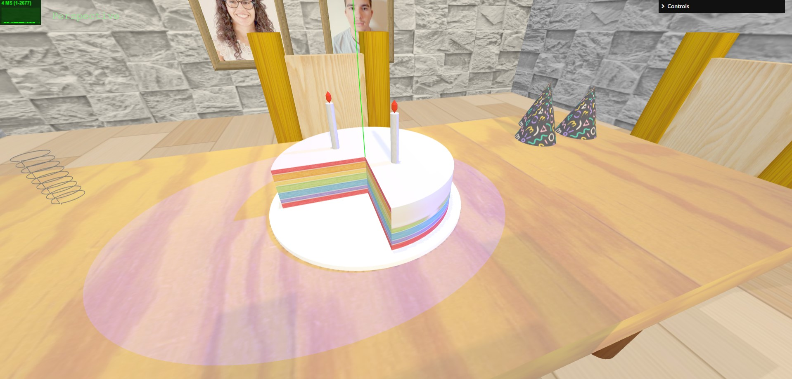

Regarding the paintings, we took the approach of creating two separate BoxGeometry meshes for each painting, one for the student's photo and one for the frame itself. We then just had to scale up the frame to make it stand out, and apply the needed textures. 

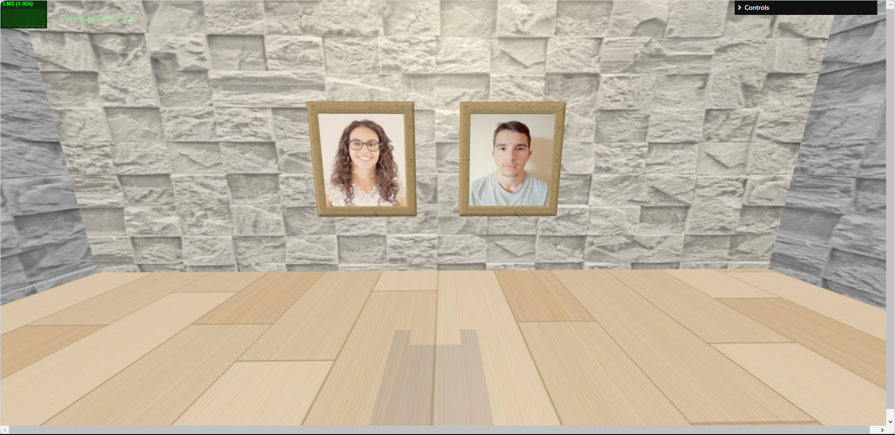

We used a similar approach to the one above for the window, since we also had one BoxGeometry mesh for the frame, and another one for the window scenery. All needed to do was scale the window to its correct size, and apply the correct textures.
One of the hardest tasks of this project was drawing the vase and the flower. First, we studied how to draw curved surfaces, but it was difficult to calculate the control points. After some trial and error, we finally got a surface that resembled a vase. Then, we only needed to duplicate and mirror it to get the full object. For the flower, both the petals and the center were constructed with SphereGeometry.

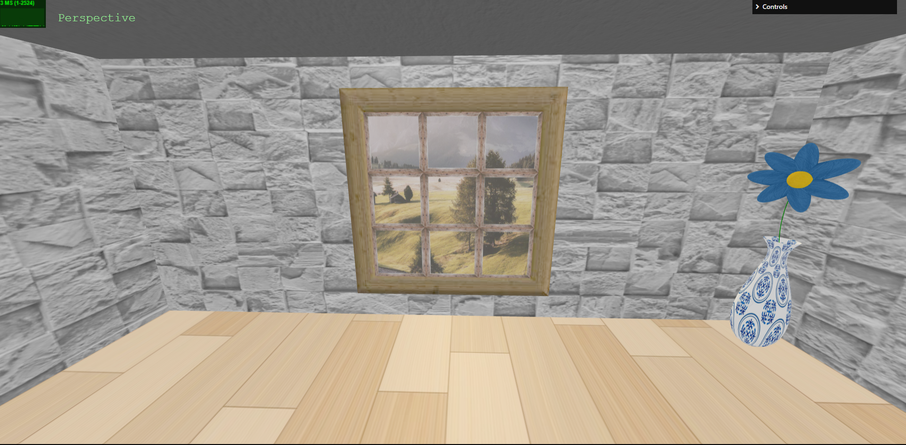

With enhancing the scene in mind, we took the liberty of adding a door to one of our walls, using a BoxGeometry for it and applying a wooden texture, to better fit with the rest of the objects in our room.

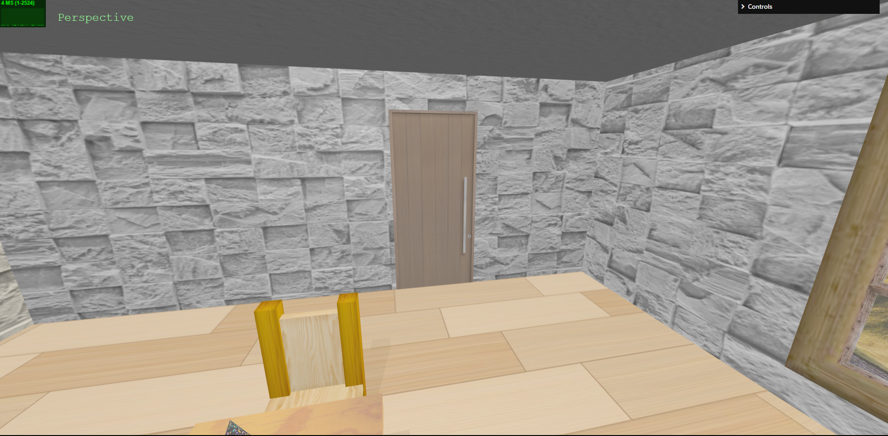

As for the spring, we decided to build it using simple circles with an adjustable number of circles and radius. We took what was given to us in the T1 guide (available in moodle) in the section Polyline. Using the code as a base, we then tried to come up with an automatic way to calculate the needed points for the spring, eventually realizing that we could manipulate the angle in order to correctly build a spiral.

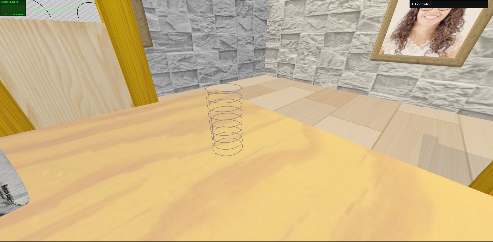

The newspaper was one of our most complex tasks, given that we didn't really understood how to draw it at first. After experimenting a lot, we used a curved surface messing around with the control points until we reached the desired curvation for it. After that, we applied a texture with an old portuguese newspaper "O Século" and we were good to go.

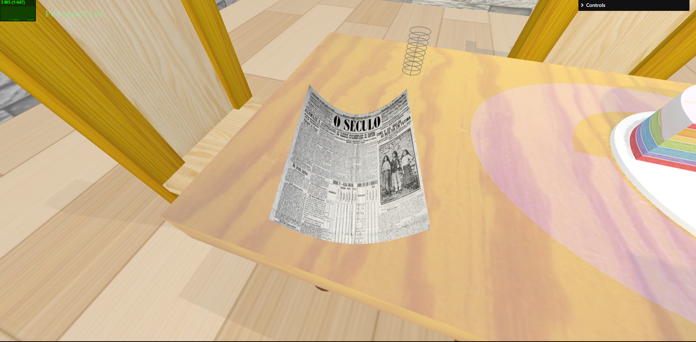

For the car frame, we experimented a bit with different types of curve lines, concluding that the cubic bezier curves gived us the best results without too much complexity.

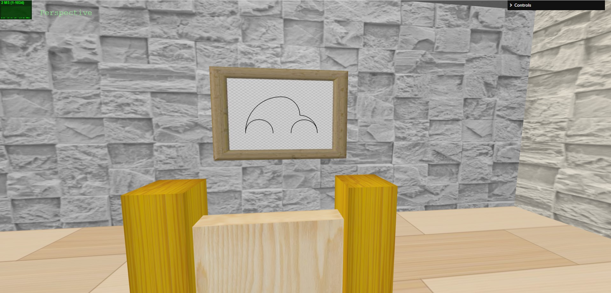

For this room, we have 4 different lights: ambient, point, spot and directional light. The last three are the only ones able to cast shadows. Then, we altered some objects like the floor, table, chairs, cake and candles to receive and cast shadows.

As it's visible in the screenshot below, we divided this GUI in four main folders (plus one invisible in the screenshot that only changes the camera position). We decided to allow the customization of the spotlight, permitting the change of its color, intensity, distance as well as most position attributes. We also included a Time folder, that allows the customization of the Time of the scene (expressed in hours), that affects the directional light coming through the window (changing its rays). It's also possible to decide which lights should or should not be visible through the checkboxes on the Active Lights folder. To mess around with the walls, the user can decide on one of four different textures he wants to apply, as well as customize the wrapping modes, repeat values, offsets and rotation.

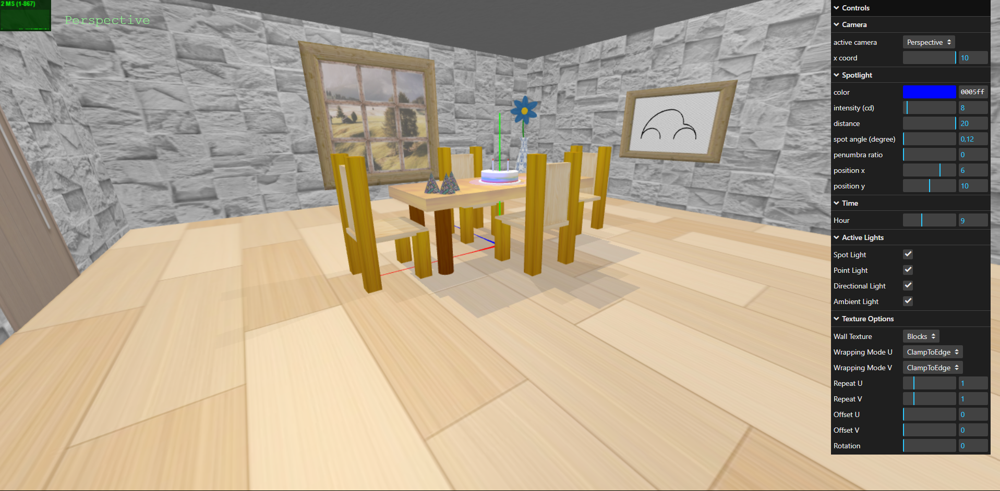

-----

### [TP2 - Development of a 3D graphics application](tp2)

#### Project Description

In the course of the second project, we decided on building a Christmas-themed room to match the Holiday Spirit. This includes a Christmas tree with presents underneath it, a big Santa Claus painting, a fireplace with logs aside it, three chairs to sit comfortably in next to the fire, and an eletrical piano to fill the air with magical tunes.

#### Scene

The room is contained inside a skybox, that tries to resemble the outside world.

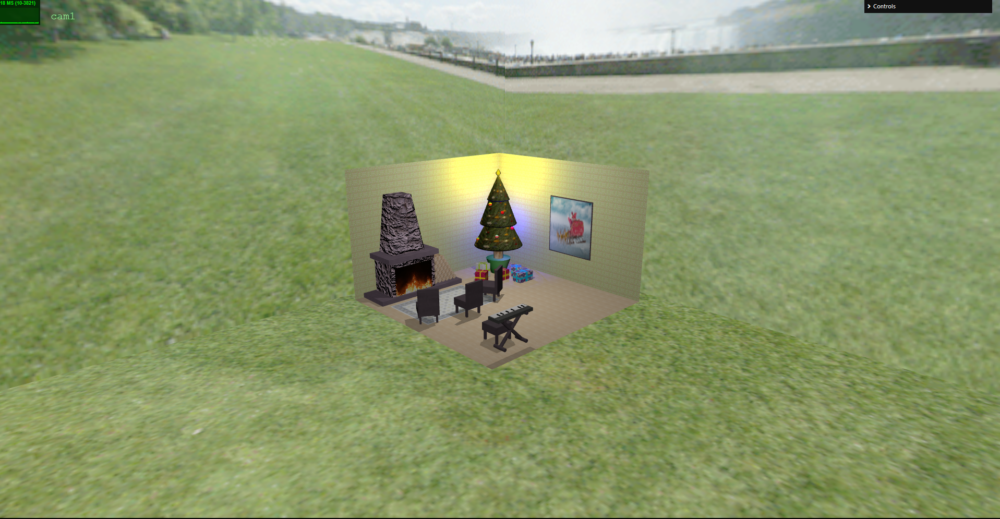

The Fireplace is one of our most complex objects, having three different Geometries in its use: (Rectangle, UnitCube, and CylinderGeometry). For the base and the divider between the Fireplace and the Chimney, we opted on using a scaled UnitCube with a wooden texture applied to it to resemble a more rustic look. As for the fireplace itself, we opted on using an UnitCube as well, but with a granite-like bump texture this time, to have a more stoney look, as well as a Rectangle to compose the visor, with a video texture of fire burning. On the other hand, while building the Chimney, we decided on using a CylinderGeometry with 4 slices as we believed it would be the best way to make it look like a prism, while applying the same granite texture as before. For each log, we also used the CylinderGeometry and a lighter wooden bump texture, to add a rough feeling to the entire object. It's important to note that, when viewing from a higher distance, the logs become a prism of the same texture, to optimize the scene's rendering.

As for the Tree, we decided on using a three-fold construction, where each segment uses a CylinderGeometry to 
give the overall object the aspect of different layers stacked on each other, with the wireframe attribute active. We also chose to place several Christmas Balls to ornament the Tree, using BufferGeometry on each one of them, with different colors applied. From a large distance, the Tree becomes a simple cone (also using CylinderGeometry) to, once again, optimize the rendering. In addition to this, we also added a Prism to resemble a Star on top of the tree, with a Golden Light inside it, simulating the Star's Brightness. To add complexity to the object, we chose to add three different point lights that flicker over time. The gifts underneath it were built using simple unitcubes, with textures manipulated by us to better resemble a Christmas present. 

The chairs were built by combining differently scaled UnitCubes and by applying a wodden texture to the overall object. They are also manipulable via the Interface, as we show in the last point. 

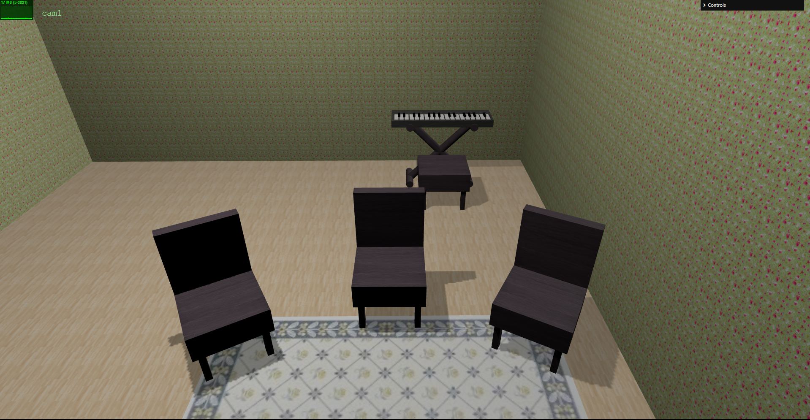

The eletric piano was also built using UnitCubes and the CylinderGeometry. For the stool, we decided to build a backless chair, to reallistically resemble a piano stool, using UnitCubes for both the legs, and the seat. As for the instrument itself, we decided on constructing a cylinder base, as it would be the most similar to the ones sustaining real-life pianos, as well as a simple keyboard, with no extra buttons apart from the keys. The base was built using six different Cylinders, two directly below the keyboard, two directly above the ground, and two intersecting in the middle, forming a cross to provide stability.
The piano is also built taking into account the distance from where the user is seeing it. From a short range, it presents immense detail, including realistic keys. From medium range, some keys become invisible, as well as the gap between the white keys, and from long range, only a white blur is visible on the keyboard, to better fit the human perception at such a distance. 

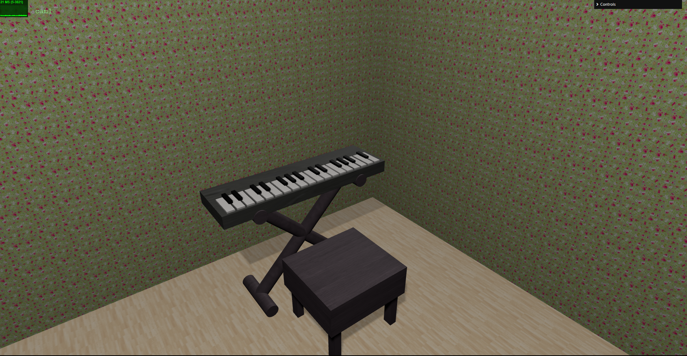

While building the painting, we decided on implementing 3 different paintings using different mipmapping techniques. For the Christmas one, we chose to allow automatic mipmapping, whereas for the other 2 paintings, we manually created textures for every mipmap level, them being (256x256, 128x128, 64x64, 32x32, 16x16, 8x8). We also allow the user to select the far and close filter that better fits their desire on the interface. 

We can, at most, have 6 visible lights in scene at the same time. These lights include the 4 on the Christmas Tree, and an additional PointLight and Directional Light, created purely to lighten the overall scene. All lights have the ability to cast shadows on every object. 

On our interface we allow a detailed scene customization of two different types: Attributes only working on our scene, Attributes working on every possible scene. 
For the scene-exclusive customization, we provide position sliders for each one of the chairs, different choseable paintings and toggles that allow an object to be converted to a wireframe. 
For the general customizable attributes, we allow the user to hide every texture and apply or not apply bumps to them by clicking on the checkbox, as well as change the scale of every bump texture on the scene using a slider. 

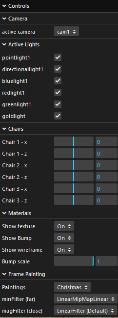

----

### [TP3 - ...](tp3)
- (items briefly describing main strong points)

